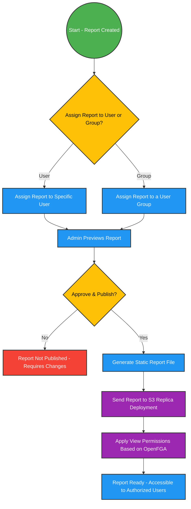

## **1. Overview**  

The **Reports Management System** is designed to **securely manage and distribute reports** using **OpenFGA** for access control. It ensures that only authorized users or groups can access published reports by assigning permissions at the time of publication.  

Reports follow a **static deployment model**, which differs from dynamic deployments by strictly separating **write, read, build, and send operations**. Reports are **generated, published, and stored on an S3-based replica deployment**, where they are **read-only** and accessible **only to users or groups with assigned permissions**.  

---

## **2. Core Functionalities**  

### **2.1 Report Assignment & Permissions**  
- **OpenFGA manages access control**, allowing:  
  - **User-Specific Permissions** → Reports assigned to individual users.  
  - **Group-Based Permissions** → Reports assigned to a user group.  
- Permissions are defined through **relations and tuples** in OpenFGA, ensuring flexible and scalable access control.  

---

### **2.2 Report Creation & Publishing Workflow**  

1. **Report Assignment**  
   - A new report **must be assigned** to either a **specific user or a group** before publishing.  
   - **Only assigned users or groups will have access** once the report is published.  

2. **Preview & Review**  
   - Before publishing, an **Admin previews** the report to ensure accuracy and compliance.  

3. **Publishing & Deployment**  
   - Once approved, the **Admin publishes the report**, triggering the following steps:  
     1. **The report is converted into a static file.**  
     2. **The file is deployed to an S3-based static replica deployment.**  
     3. **Permissions from OpenFGA are applied, ensuring only authorized users or groups can access the report.**  

---

### **2.3 Static vs. Dynamic Deployment**  

Unlike **dynamic deployments**, where reports can be updated in real time, **static deployments** on S3 follow a structured **write-read-build-send** process:  

| **Process** | **Dynamic Deployment** 🟠 | **Static S3 Deployment** 🟢 |
|------------|--------------------------|---------------------------|
| **Write** | Users can edit reports after publishing ✅ | Reports are immutable after publishing ❌ |
| **Read** | Users see real-time updates ✅ | Users access a pre-built, unchangeable version ✅ |
| **Build** | Reports are dynamically generated when accessed ✅ | Reports are pre-generated before deployment ✅ |
| **Send** | Changes are pushed dynamically ✅ | Reports are explicitly sent to S3 with set permissions ❌ |

✅ = Allowed | ❌ = Not Allowed  

In the **static deployment model**, reports are **finalized before deployment**, ensuring **security, consistency, and strict permission-based access** for authorized users.  

---

## **3. Access Control & Permissions**  

The system uses **OpenFGA’s role-based authorization model** to determine **who can access what**:  

- **Users and Groups are linked to reports** through OpenFGA relations.  
- **Permissions are enforced at the moment of publishing**, ensuring access is controlled from the start.  
- **Only assigned users or groups can view a report on the static S3 deployment.**  

### **OpenFGA Role Examples**  

| **Report ID** | **Relation** | **User/Group** | **Access** |
|------------|------------|----------------|------------|
| `report:monthly-sales` | `viewer` | `user:jane.doe@example.com` | ✅ `jane.doe@example.com` can view the report |
| `report:monthly-sales` | `viewer` | `group:finance-team` | ✅ All users in `finance-team` can view the report |
| `report:monthly-sales` | `editor` | `user:john.smith@example.com` | ✅ `john.smith@example.com` can edit the report (before publishing) |
| `report:monthly-sales` | `viewer` | `user:mike.adams@example.com` | ❌ `mike.adams@example.com` cannot view the report |

Once a report is **published**, **only `viewer` roles remain active**, as editing is no longer permitted on the static S3 deployment.  

