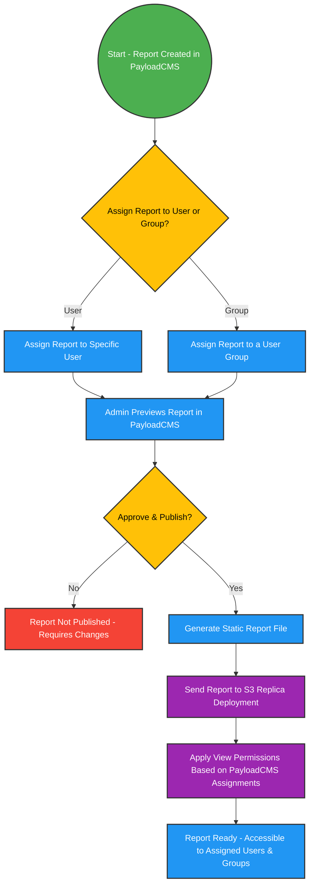

 

## **1. Overview**  

The **Reports Management System** is designed to **securely manage and distribute reports** using **PayloadCMS as the administrative dashboard**. It ensures that **only assigned users or groups** can access published reports by defining permissions before deployment.  

Reports follow a **static deployment model**, where they are **created, reviewed, assigned, and published via PayloadCMS** and then **sent as static files to an S3-based replica deployment** for **read-only access**.  

---

## **2. Core Functionalities**  

### **2.1 Report Assignment & Permissions in PayloadCMS**  

- **PayloadCMS is used as the admin dashboard** for managing reports.  
- **Permissions are assigned within PayloadCMS**, allowing reports to be restricted to:  
  - **Specific users** → The report is assigned directly to an individual.  
  - **Groups** → The report is assigned to a predefined user group.  
- **Only assigned users or groups can access the report after publishing.**  

---

### **2.2 Report Creation & Publishing Workflow**  

1. **Report Creation & Assignment**  
   - A new report is created in **PayloadCMS**.  
   - The admin **assigns the report** to **specific users or groups** before publishing.  

2. **Preview & Review**  
   - Before publishing, an **Admin previews** the report inside PayloadCMS.  

3. **Publishing & Deployment**  
   - Once approved, the **Admin publishes the report**, triggering the following actions:  
     1. **The report is converted into a static file.**  
     2. **The file is sent to the S3-based static deployment.**  
     3. **Permissions from PayloadCMS are applied, ensuring only assigned users or groups can access it.**  

---

### **2.3 Static vs. Dynamic Deployment**  

Unlike **dynamic deployments**, where reports can be modified in real time, **static deployments** on S3 follow a structured **write-read-build-send** process:  

| **Process** | **Dynamic Deployment** 🟠 | **Static S3 Deployment** 🟢 |
|------------|--------------------------|---------------------------|
| **Write** | Users can edit reports after publishing ✅ | Reports are immutable after publishing ❌ |
| **Read** | Users see real-time updates ✅ | Users access a pre-built, unchangeable version ✅ |
| **Build** | Reports are dynamically generated when accessed ✅ | Reports are pre-generated before deployment ✅ |
| **Send** | Changes are pushed dynamically ✅ | Reports are explicitly sent to S3 with set permissions ❌ |

✅ = Allowed | ❌ = Not Allowed  

In the **static deployment model**, reports are **finalized before deployment**, ensuring **security, consistency, and strict permission-based access** for authorized users.  

---

## **3. Access Control & Permissions**  

The system uses **PayloadCMS’s built-in access control** to determine **who can access which reports**:  

- **Users and Groups are linked to reports** through PayloadCMS’s role-based system.  
- **Permissions are enforced at the moment of publishing**, ensuring access is controlled from the start.  
- **Only assigned users or groups can view a report on the static S3 deployment.**  

### **PayloadCMS Role Examples**  

| **Report ID** | **Assigned To** | **Access** |
|--------------|---------------|------------|
| `report:monthly-sales` | `jane.doe@example.com` | ✅ `jane.doe@example.com` can view the report |
| `report:monthly-sales` | `finance-team` | ✅ All users in `finance-team` can view the report |
| `report:monthly-sales` | `john.smith@example.com` | ✅ `john.smith@example.com` can edit the report (before publishing) |
| `report:monthly-sales` | `mike.adams@example.com` | ❌ `mike.adams@example.com` cannot view the report |

Once a report is **published**, **only assigned users with view permissions** can access it, as editing is no longer possible on the static S3 deployment.  

---

